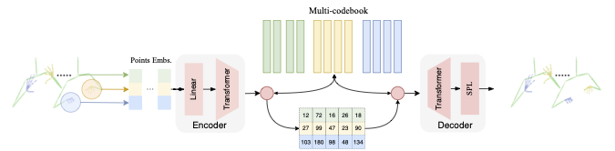
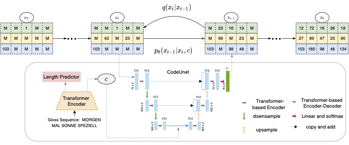

# G2P-DDM
[Project Link](https://slpdiffusier.github.io/g2p-ddm/) | [Demo Link](https://slpdiffusier.github.io/g2p-ddm/) | [Supplementary Materials](https://github.com/Anynoumsiccv9970/G2P-DDM/blob/main/ICCV9970_supplementary.pdf)

This repository contains the implementation of our paper "G2P-DDM: Generating Sign Pose Sequence from Gloss Sequence with Discrete Diffusion Model".

# requirements

```bash
pip install -r requirements.txt
```

# Traning

## Stage 1: Pose-VQVAE for Reconstruction


```bash
python3 -m train_pose_vqvae \
    --gpus 8 --gpu_ids "0,1,2,3,4,5,6,7" \
    --init_lr 2e-4 \
    --embedding_dim 128 \
    --batchSize 12 \
    --n_codes 1024 \
    --data_path "Data/ProgressiveTransformersSLP" \
    --vocab_file "Data/ProgressiveTransformersSLP/src_vocab.txt" \
    --resume_ckpt "" \
    --default_root_dir "experiments/pose_vqvae/separate" \
    --max_steps 300000 \
    --max_frames_num 300 \
```

## Stage 2: Discrete Diffusion Model for Latent Prior Learning

```bash
python3 -m train_text2pose --gpus 4 --gpu_ids "0,1,2,3" \
    --stage2_model "configs/stage2_model/vq_diffusion_codeunet.yaml"  \
    --default_root_dir "experiments/text2pose/vq_diffusion_codeunet"
```

# Inference

```
python3 -m train_text2pose --gpus 8 --gpu_ids "0,1,2,3,4,5,6,7" \
    --stage2_model "configs/stage2_model/vq_diffusion_codeunet.yaml"  \
    --default_root_dir "experiments/text2pose/test"
```
